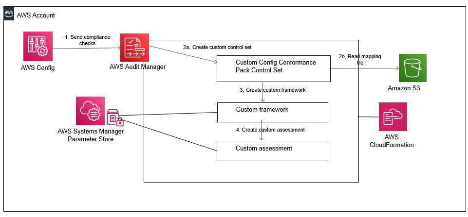
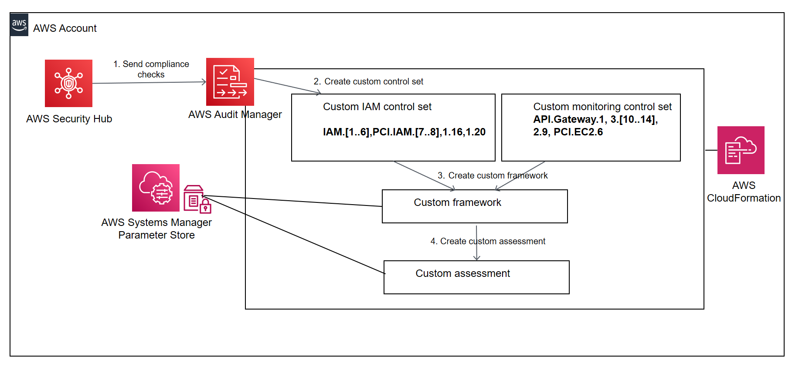

This reference architecture will help you get started with the three
lines of defense model using AWS Platforms. Each directory in the
repository contains its own readme file with more details. This readme
explains the purpose of the samples and provides and overview.

+ [Overview ](#overview)

+ [Managing Risk ](#managing-risk)

+ [Overseeing Risk ](#overseeing-risk)

+ [Providing assurance of risk management.
](#providing-assurance-of-risk-management.)

+ [Contents ](#contents)
	- [AWS Audit Manager -- Conformance pack
](#aws-audit-manager-conformance-pack)

	- [AWS Audit Manager -- Security Hub ](#aws-audit-manager-security-hub)

	- [AWS Config Aggregator ](#aws-config-aggregator)

	- [AWS Enable Config ](#aws-enable-config)

	- [AWS Organizational Conformance Pack
](#aws-organizational-conformance-pack)

	- [AWS Remediation CIS Security Hub ](#aws-remediation-cis-security-hub)

	- [AWS Service Catalog prescriptive compliance
](#aws-service-catalog-prescriptive-compliance)

Overview 
========

As organizations mature or start their journey into cloud infrastructure
management, they quickly realize the importance of security, compliance
and audit preparation. Amazon Web Services provides a wide range of
capabilities to help with compliance and auditing. How do these tools
work together to simplify compliance at scale? To understand how these
tools work better, let us consider the concept of the three lines of
defense.

The Three Lines Model developed by the Institute of Internal Auditors
(IIA) helps organizations identify structures and processes to
facilitate strong governance and risk management. In that model, the
first-line function manages risk, the second-line function oversees risk
and the third-line function provides objective and independent assurance
of risk management. According to a Deloitte analysis titled 'Modernizing
the three lines of defense model', internal audit (IA) functions can
have the strongest impact in their organizations by automating assurance
tasks and by providing real time integrations and insight into emerging
risks. Internal Audit can then use the monitoring of results, perform
agile testing of controls and provide relevant assurance and advice to
achieve strong impact for the organization.

Managing Risk
=============

[AWS Config](https://aws.amazon.com/config/) is a service that enables
you to assess, audit, and evaluate the configurations of your AWS
resources. Config continuously monitors and records your AWS resource
configurations and allows you to automate the evaluation of recorded
configurations against desired configurations. With Config, you can
review changes in configurations and relationships between AWS
resources, dive into detailed resource configuration histories, and
determine your overall compliance against the configurations specified
in your internal guidelines. This enables you to simplify compliance
auditing, security analysis, change management, and operational
troubleshooting.

[AWS CloudTrail](https://aws.amazon.com/cloudtrail/) is a service that
enables governance, compliance, operational auditing, and risk auditing
of your AWS account. With CloudTrail, you can log, continuously monitor,
and retain account activity related to actions across your AWS
infrastructure. CloudTrail provides event history of your AWS account
activity, including actions taken through the AWS Management Console,
AWS SDKs, command line tools, and other AWS services. This event history
simplifies security analysis, resource change tracking, and
troubleshooting. In addition, you can use CloudTrail to detect unusual
activity in your AWS accounts. These capabilities help simplify
operational analysis and troubleshooting.

[AWS Systems Manager](https://aws.amazon.com/systems-manager/) is the
operations hub for AWS. Systems Manager provides a unified user
interface so you can track and resolve operational issues across your
AWS applications and resources from a central place. With Systems
Manager, you can automate operational tasks for Amazon EC2 instances or
Amazon RDS instances. You can also group resources by application, view
operational data for monitoring and troubleshooting, implement
pre-approved change work flows, and audit operational changes for your
groups of resources. Systems Manager simplifies resource and application
management, shortens the time to detect and resolve operational
problems, and makes it easier to operate and manage your infrastructure
at scale. AWS Systems Manager extends compliance tracking and reporting
to the ec2 instance level. It helps simplify vulnerability management
and deploy automated remediations for non-compliant resources.

Overseeing Risk 
===============

[AWS Security Hub](https://aws.amazon.com/security-hub/) is designed to
give you a comprehensive view of your security posture across your AWS
accounts. With Security Hub, you now have a single service that
aggregates, organizes, and prioritizes your security alerts or findings
from multiple AWS services. When you apply the three lines model to AWS
services, AWS Security Hub provides the second-line function of
overseeing risk.

Providing assurance of risk management. 
=======================================

[AWS Audit Manager](https://aws.amazon.com/audit-manager/) provides
continuous and automated gathering of evidence related to your AWS
resource usage. It helps simplify risk assessment and compliance with
regulations and open standards and helps you maintain a continuous,
audit-ready posture to provide a faster, less disruptive preparation
process. When you apply the three lines model to AWS services, AWS Audit
Manager provides the third-line function by enabling objective and
independent assurance of risk management.

Contents 
========

This sample repository contains the following solutions to get started

AWS Audit Manager -- Conformance pack
-------------------------------------

Converts an AWS Config Conformance Pack into an AWS Audit Manager
Assessment

The Audit Manager assessment is based on a custom AWS Audit Manager
framework that is comprised of custom AWS Audit Manager control sets.
The Audit Manager control set contains custom AWS Audit Manager controls
related to AWS Config Conformance Pack based Config rules.

AWS Audit Manager -- Security Hub
---------------------------------

Creates a custom AWS Audit Manager framework that is comprised of custom
AWS Audit Manager control sets. The custom Audit Manager control set
contains custom AWS Audit Manager controls related to AWS Security Hub
findings that span across AWS Security Hub FSBP, CIS and PCI compliance
checks. So, instead of the control set being specific to an individual
AWS Security Hub compliance check (FSBP,CIS or PCI), the control set
spans across Security Hub compliance checks and is specific to a
security related domain -- for e.g. Identity Management or Network
Monitoring.

AWS Config Aggregator
---------------------

Automatically enables an AWS Config aggregator across multiple accounts
and regions. An AWS Config Aggregator is an AWS Config resource type
that collects AWS Config configuration and compliance data from multiple
accounts and regions or from an AWS organization. All accounts must have
AWS Config enabled (See the solution to enable AWS Config).

AWS Enable Config
-----------------

Enable AWS Config across multiple accounts and regions using StackSets.
You can also use the AWS Config recording setup provides by AWS Systems
Manager . See
[here](https://docs.aws.amazon.com/systems-manager/latest/userguide/quick-setup-config.html)
for more information

AWS Organizational Conformance Pack 
-----------------------------------

This sample template can be used to deploy an organizational conformance
pack. You can use CloudFormation StackSets to deploy to multiple regions
also.

AWS Remediation CIS Security Hub
--------------------------------

The solution implemented here leverages the AWS Security Hub service and
provides customers with an AWS native implementation for automated
remediations for these CIS violations detected by AWS Security Hub.

AWS Service Catalog prescriptive compliance 
-------------------------------------------

Standardize the provisioning and set up of configuration compliance
using AWS Service Catalog and AWS Config Rules with custom Config
Remediations
