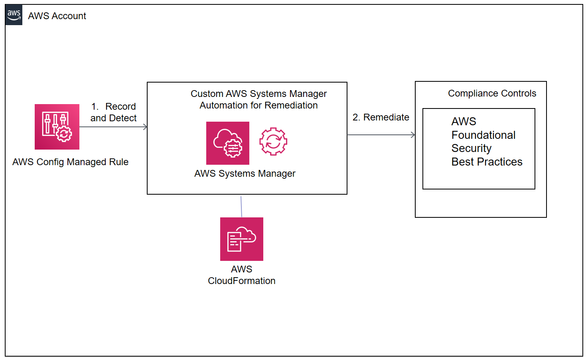

# Remediations for AWS FSBP Benchmarks using AWS Config and custom AWS Systems Manager Automation Documents

Template 1 first provisions AWS Systems Manager Automation Documents as well as all the required pre-reqs. Template 2 then leverages the Systems Manager Automation documents within AWS Config Remediation Rules.

## COVERAGE

The solution provides remediations for the following AWS FSBP checks:
* [EC2.3] Attached EBS volumes should be encrypted at-rest
* [GuardDuty.1] GuardDuty should be enabled
* [IAM.3] IAM users' access keys should be rotated every 90 days or less
* [Lambda.1] Lambda functions should prohibit public access by other accounts
* [Lambda.2] Lambda functions should use latest runtimes
* [RDS.3] RDS DB instances should have encryption at-rest enabled
* [SSM.1] EC2 instances should be managed by AWS Systems Manager
* [AutoScaling.1] Auto Scaling groups associated with a load balancer should use load balancer health checks
* [CloudTrail.1] CloudTrail should be enabled and configured with at least one multi-Region trail
* [CloudTrail.2] CloudTrail should have encryption at-rest enabled
* [CodeBuild.2] CodeBuild project environment variables should not contain clear text credentials
* [Config.1] AWS Config should be enabled
* [EC2.1] Amazon EBS snapshots should not be public, determined by the ability to be restorable by anyone
* [EC2.2] The VPC default security group should not allow inbound and outbound traffic
* [IAM.1] IAM policies should not allow full * administrative privileges
* [IAM.2] IAM users should not have IAM policies attached
* [IAM.4] IAM root user access key should not exist
* [IAM.7] Password policies for IAM users should have strong configurations
* [S3.1] S3 Block Public Access setting should be enabled
* [S3.2] S3 buckets should prohibit public read access
* [S3.3] S3 buckets should prohibit public write access
* [S3.4] S3 buckets should have server-side encryption enabled
* [RDS.1] RDS snapshots should be private
* [RDS.2] RDS DB instances should prohibit public access, determined by the PubliclyAccessible configuration
* [SSM.2] Amazon EC2 instances managed by Systems Manager should have a patch compliance status of COMPLIANT after a patch installation 
 
## Solution Design

## How To Install

1. **Template 1 of 2:** aws-fsbp-systemsmanagerautomations.yml
* Provisions AWS Systems Manager automation documents. These documents are used to provide automated remediations within the provisioned AWS Config Rule.
* Provisions with fully built-in pre-reqs. No input parameters required. Simply install on the CloudFormation console (or CLI). Installs in approx 3-4 mins.

2. **Template 2 of 2:** aws-fsbp-configremediations.yml
* Provisions AWS Config Managed Rules and attaches the custom AWS Systems Manager automation documents as AWS Config Remediations to the AWS Config Managed Rule. No input parameters. Simply install on the CloudFormation console (or CLI). Installs in approx 3-4 mins.
* Leverages the output from the previous template specifically the AWS Systems Manager Automation documents

## Author

Kanishk Mahajan; kmmahaj@amazon.com
