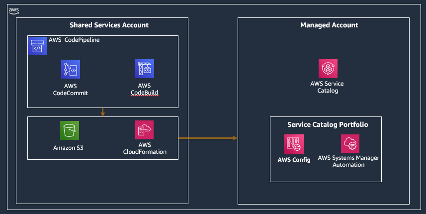

# Prescriptive Compliance with Service Catalog and Config. Use a CCOE approach to standardize compliance

 This solution demonstrates the combined use of DevOps automation and Infrastructure as Code (IaC) via AWS CodePipeline, AWS Service Catalog and AWS CloudFormation to enable CCOE (Cloud Center of Excellence) AWS administrators and infrastructure engineers to automate the management and deployment of Service Catalog Portfolios that contain Service Catalog Products containing AWS Config rules and integrated AWS Systems Manager (SSM) remediation runbooks

 We will deploy this solution in a multi account organization.  Our organization deployed via AWS Organizations comprises of a Shared Services account which is where CCOE (Cloud Center of Excellence) administrators can deploy shared service and can add/remove/update compliance rules. These updates flow through a devops based AWS CodePipeline deployment to the managed accounts and result in updated compliance related Service Catalog Portfolios in the managed accounts. The entire solution is setup in 1 step with Infrastructure as Code (IaC) automation using AWS CloudFormation.

## Personas

1. CCOE AWS administrator
	1. The CCOE administrator performs initial setup from the shared services account. After setup, the DevOps infrastructure (AWS CodePipeline) is provisioned in the shared services account, and an AWS Service Catalog Portfolio with Config rules and integrated remediation runbooks is provisioned in the managed accounts.
	2. The CCOE administrator also performs code updates from the local Git repository. The administrator checks in updated Config rules and remediation runbook templates and (optionally) an updated buildspec.yaml file. The updated code flows via AWS CodePipeline in the AWS shared services account and updates the AWS Service Catalog Portfolio in the managed accounts.

2. End user / AWS administrator in the managed accounts
The end user launches the Config rules and integrated remediation runbooks from the AWS Service Catalog console in the managed account. 

## What is implemented

The following AWS CloudFormation templates have been implemented for this solution -
1. aws-servicecatalog-codepipeline.yaml – Sets up the AWS CodePipeline automation in the Shared Services account that distributes service catalog portfolios to the managed accounts
2. aws-servicecatalog-prescriptivecompliance.yml – Sets up the  AWS Service Catalog Portfolio that consists of  Service Catalog Products comprised of Config rules with remediation runbooks

## Architecture

## Pre-requisites

1. As a CCOE AWS administrator signed in to the AWS shared services account, set up the following resources.
Enable AWS Config in the shared service account and all your managed accounts in the organization. [Perform step 1 from the Automate configuration compliance at scale blog post](https://aws.amazon.com/blogs/mt/automate-configuration-compliance-at-scale-in-aws/) to use Systems Manager quick setup to do that with just a few clicks from your console.
2.	Integrate AWS Cloud9 local Git repository with AWS CodeCommit remote Git repository
	1. Use the aws-servicecatalog-configremediations-v1.yml AWS CloudFormation template that contains AWS Config Managed rules with integrated AWS Systems Manager remediation runbooks for common cloud configuration compliance violations. You can get the AWS CloudFormation template that provides a full coverage of PCI rules with SSM remediation runbooks from this [PCI and FSBP Config Rules with built-in SSM remediations](https://github.com/aws-samples/aws-config-pci-fsbp-ssmremediations) repository
	2. Create an AWS CodeCommit Git repository in the shared services account and integrate it with your local Git repository. Using AWS Cloud9 is one of the easiest ways in AWS to set up a local Git repository and integrate with CodeCommit as the remote Git repository.  
3.	Download these files from this solution’s GitHub repo and upload them to your Cloud9 local Git repository.The local Cloud9 Git repository contains the following files in this structure.
	1. Compliance product templates:
		1. aws-servicecatalog-configremediations-v1.yml in a *compliance* folder
		2. aws-servicecatalog-prescriptivecompliance.yml in the root folder
	2. buildspec.yml in the root folder
	3. buildspec-update.yml in the root folder
4.	Create an S3 staging bucket using this naming convention: s3-configremediations-*accountid*-*region*. Create a folder called *compliance* in your S3 bucket. The folder names here need to match the folder names in your local Git repository. You can create these folders with any names as long as those are the same names used while creating your local Git repository there.
5.	In the following files that are available for download from the solution, substitute the *accountid* parameter with the AWS Account ID of the shared services account. Substitute the *region* parameter with the AWS region of your shared services account. Substitute the *managedaccount* and *managedregion* parameters with comma separated AWS Account IDs and comma separated AWS regions respectively of the managed accounts where the solution will be deployed.
	1. buildspec.yml
	2. buildspec-updates.yml

## How to Install

The initial set up is done in 1 step by the CCOE (Cloud Center of Excellence) AWS Administrator from the shared services account.

1. Launch the aws-servicecatalog-codepipeline.yml template. The template takes the following parameters and you can accept all defaults.
	1. RepositoryName: CodeCommit repository for the Config remediation CloudFormation templates
	2. BranchName: Branch in the CodeCommit repository for the Config Remediation CloudFormation templates
	3. S3StagingBucketPrefix: Prefix for the S3 Staging Bucket that stages the code copied from code commit.  In our case this is s3-configremediations-*accountid*-*region*
 

## Validate compliance

Test and validate the standardized compliance posture that CCOE teams can enforce across managed accounts using AWS Service Catalog

**Step 1: Launch the Service Catalog Product**
1. Log in to the IAM console of the AWS managed account as an administrator and create an IAM user that is a member of the EnduserGroup and logout of the managed account.
2. Navigate to the AWS Service Catalog console of the managed account as the IAM end user that was created and navigate to the left sidebar and choose Products. 
	1. Select the *AWS ConfigRemediations Compliance Product* product, accept the defaults and select *Launch Product*. The Service Catalog product screen will auto refresh until the product has been launched. Select *Provisioned Products* from the left sidebar to validate that the product has been launched and the status shows available.

**Step 2: Review provisioned Config rules with attached remediation runbooks**
1. Navigate to the AWS Config Console of the managed account. You will see that several AWS Config rules - specifically ‘cloud-trail-log-file-validation-enabled’, ‘ReleaseElasticIP’, ‘cloud_trail_cloud_watch_logs_enabled’, ‘cmk-backing-key-rotation-enabled’ and ‘cis-iam-password-policy’- with associated remediation runbooks have been provisioned for you based on the launch of the Service Catalog product.
	1. These Config rules with associated remediations will provide continuous compliance for your AWS environment based on the evaluation of these provisioned rules.

**Step 3: Verify automated ‘attack’ and validate compliance**
1. The solution provides built-in automation that launches a *compliance attack* by simulating misconfiguration of AWS resources. Log in as an administrator in the managed account:
	1. Check that an AWS CloudTrail called ‘ReinforceTrail’ has been provisioned without log file validation and CloudWatch Logs monitoring enabled. Check that an AWS KMS Customer Master Key with description ‘Test Key Rotation’ has key rotation disabled and that there’s an Elastic IP with an unassociated EC2 instance.
	2. Navigate to the AWS Systems Manager console and select Automation in the left panel and then select Executions. Since we have launched the Service Catalog Product in the managed account, our standardized compliance posture triggers AWS Config Remediations that leverage our integrated and custom AWS Systems Manager remediation runbooks. You can monitor the Execution status in the Systems Manager Automation console for each of the automations and verify their successful automation status.
	3. Finally validate the compliance posture of the managed account by validating that each of the misconfigured resources are now in the desired state. Check that the AWS CloudTrail called ‘ReinforceTrail’ has been both log file validation and CloudWatch Logs monitoring enabled. Check that an AWS KMS Customer Master Key with description ‘Test Key Rotation’ has key rotation enabled and that the unassociated Elastic IP has been removed.
